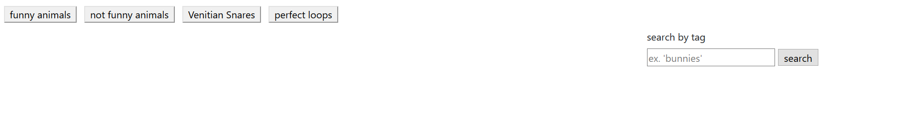
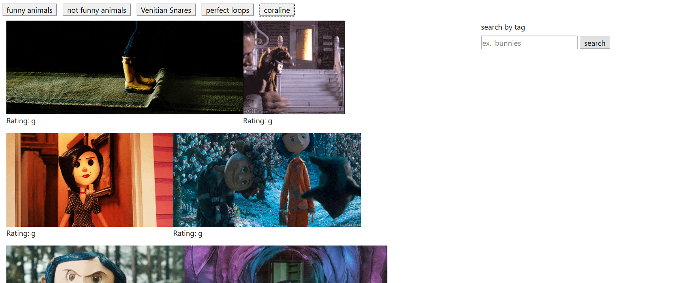
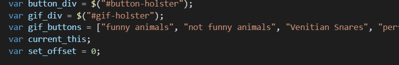
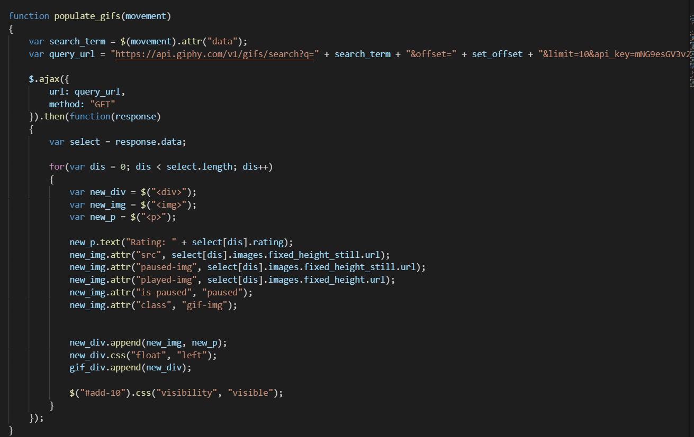

# gifgetter

## utility to load a load of gifs on load and a load more

### base goals fully satiated. buttons can be added and clicked to give lists of gifs. gifs load paused and can be played or paused by mousing over or clicking. ratings displayed under.

#### bonus goals completed include: mobile responsive (mostly, the button creating div gets set to the bottom and I'd prefer it to be at the top), add 10 button adds 10, 

#### lacking: proper css and beautification. I spent so long getting the ajax to work I ran out of time to make it look purdy.

here is the before. it is the page in its default pasty white state.

and here's after.
...bit more colour, not a lot though.

code can't run without some pretty variables.

and of course who could forget the royal pain of the hour. ser Anthony Johannes auf Xuselheim. so many things went wrong.

